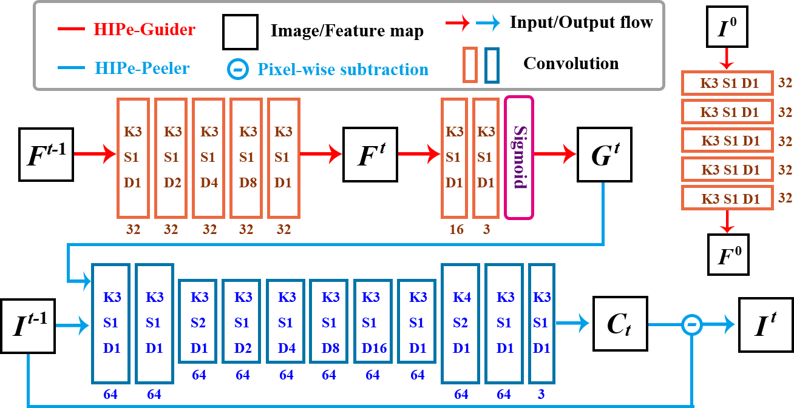
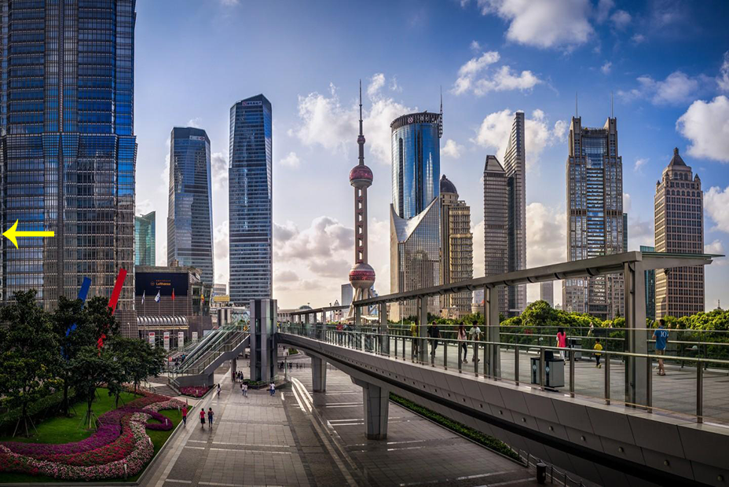
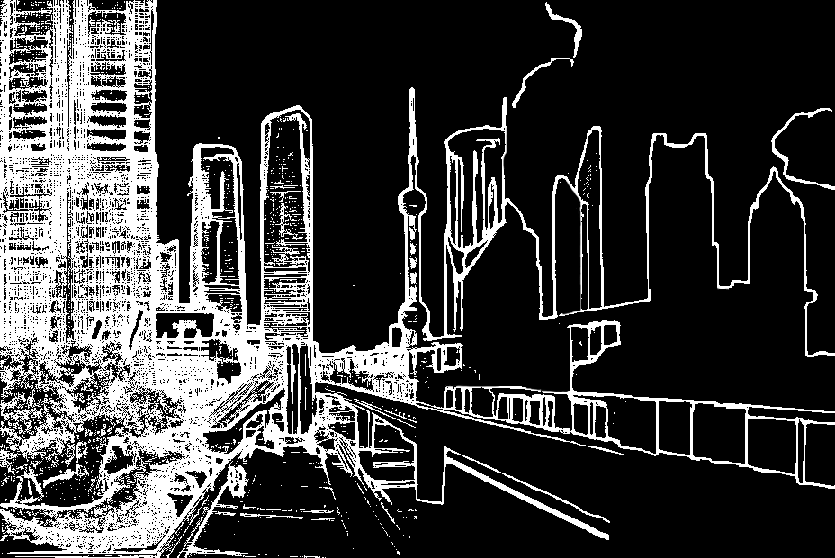
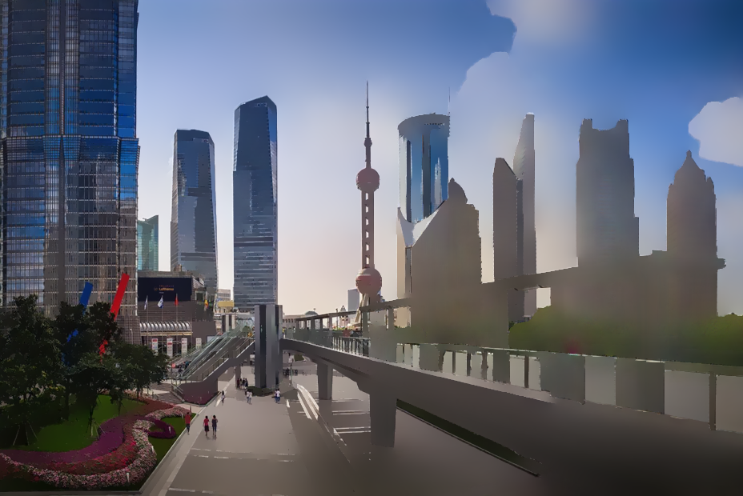
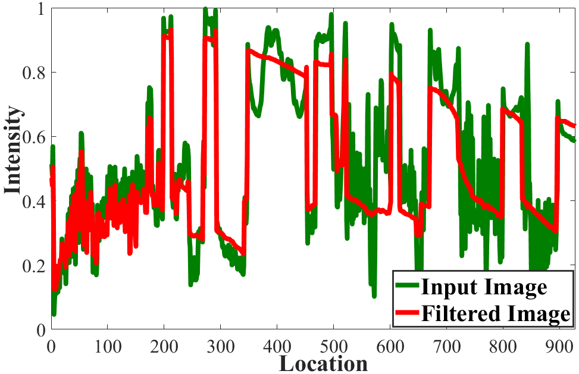

# The code for "Hierarchical Image Peeling: A Flexible Scale-space Filtering Framework"

## Introduction
The importance of hierarchical image organization has been witnessed by a wide spectrum of applications in computer vision and graphics. Different from image segmentation with the spatial whole-part consideration, this work designs a modern framework for disassembling an image into a family of derived signals from a scale-space perspective. Specifically, we first offer a formal definition of image disassembly. Then, by concerning desired properties, such as peeling hierarchy and structure preservation, we convert the original complex problem into a series of two component separation sub-problems, significantly reducing the complexity. The proposed framework is flexible to both supervised and unsupervised settings. A compact recurrent network, namely hierarchical image peeling net, is customized to efficiently and effectively fulfill the task, which is about 3.5Mb in size, and can handle 1080p images in more than 60 fps per recurrence on a GTX 2080Ti GPU, making it attractive for practical use. Both theoretical findings and experimental results are provided to demonstrate the efficacy of the proposed framework, reveal its superiority over other state-of-the-art alternatives, and show its potential to various applicable scenarios.

## Network Architecture


## Dependnecy
python 3.5, pyTorch >= 1.4.0 (from https://pytorch.org/), numpy, Pillow.
## Usage

### Training
1. Download the dataset you want to use and change the dataset directory. More datatsets can be found https://people.eecs.berkeley.edu/~taesung_park/CycleGAN/datasets/

2. Starting training using the following command

```python train.py```

If one wants to use the exemplar image which doesn't belong to target domain, just starting training using the following command

```python train_CrossDomain.py```
 
### Testing
1. Put the pre-trained model in your own path and change the checkpoint path of the code
2. Starting testing using the following command

```python test.py```

## Results
Input image             |  Multi-scale edge guidance
:-------------------------:|:-------------------------:
  |  

Filtered result             |  1-D signals of intensity corresponding to the rows indicated by the yellow arrow in input
:-------------------------:|:-------------------------:
  |  


## Citation
```
@misc{yuanbin2021hierarchical,
      title={Hierarchical Image Peeling: A Flexible Scale-space Filtering Framework}, 
      author={Fu Yuanbin and Guoxiaojie and Hu Qiming and Lin Di and Ma Jiayi and Ling Haibin},
      year={2021},
      eprint={2104.01534},
      archivePrefix={arXiv},
      primaryClass={cs.CV}
}
```
