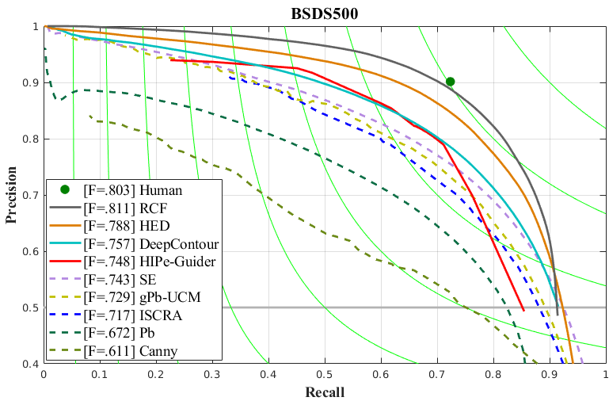
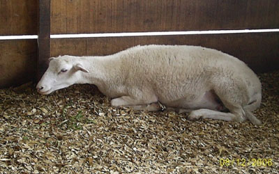
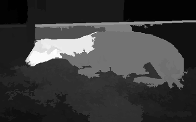
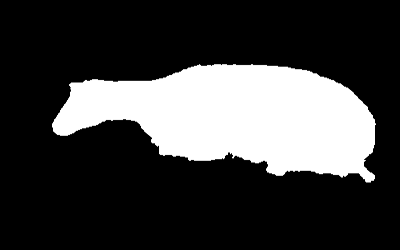

# The code for "Hierarchical Image Peeling: A Flexible Scale-space Filtering Framework"

## Introduction
This is the official code of the paper "Hierarchical Image Peeling: A Flexible Scale-space Filtering Framework" (Link: http://arxiv.org/abs/2104.01534). The importance of hierarchical image organization has been witnessed by a wide spectrum of applications in computer vision and graphics. Different from image segmentation with the spatial whole-part consideration, this work designs a modern framework for disassembling an image into a family of derived signals from a scale-space perspective. Specifically, we first offer a formal definition of image disassembly. Then, by concerning desired properties, such as peeling hierarchy and structure preservation, we convert the original complex problem into a series of two component separation sub-problems, significantly reducing the complexity. The proposed framework is flexible to both supervised and unsupervised settings. A compact recurrent network, namely hierarchical image peeling net, is customized to efficiently and effectively fulfill the task, which is about 3.5Mb in size, and can handle 1080p images in more than 60 fps per recurrence on a GTX 2080Ti GPU, making it attractive for practical use. Both theoretical findings and experimental results are provided to demonstrate the efficacy of the proposed framework, reveal its superiority over other state-of-the-art alternatives, and show its potential to various applicable scenarios.

## Network Architecture


## Dependnecy
python 3.5, pyTorch >= 1.4.0 (from https://pytorch.org/), numpy, Pillow.
## Usage

### Training
Before training and testing, the data path and output path should be properly changed.
1. Train the HIPe-Guider by running "main.py" existed in the FileFolder named "HIPe-Guider"

2. Train the HIPe-Peeler by running "main.py" existed in the FileFolder named "HIPe-Peeler"

### Testing
We provide the images for testing in FileFolder named "example", and your can change the file path to your own dataset. Our pre-trained model for HIPe-Guider and HIPe-Peeler are available at： https://pan.baidu.com/s/1xw1Z1HUxn1QmvYdYjua64A, Extraction code：lrh7
1. Run "test.py" existed in the FileFolder named "HIPe-Guider" to generate multi-scale edges as guidance

2. Run "test_smooth.py" existed in the FileFolder named "HIPe-Peeler" to peel the input image guided by the generated edges


## Results
### A peeling example
We design a flexible hierarical image peeling framework, which can produce a filtering result strictly adhering to an edge guidance with spatially-varied scales.

Input image             |  Multi-scale edge guidance
:-------------------------:|:-------------------------:
  |  

Filtered result             |  1-D signals of intensity corresponding to the rows indicated by the yellow arrow in input
:-------------------------:|:-------------------------:
  |  

### Edge detection comparison
This is the edge detection comparison in terms of precision-recall curve on the BSDS500 dataset. our method obtains the ODS-F (optimal dataset scale F-score) of 0.748, being obviously superior to Canny and Pb, competitive with DeepContour and even slightly better than ISCRA, gPb-USM and SE. Compared with the deep supervised HED and RCF, there indeed exists a margin. This is reasonable because we do not introduce any pre-trained classification
network as backbone. Our HIPe-Guider (998KB) is significantly smaller than DeepContour (27.5Mb), HED (56.1Mb) and RCF (56.5Mb). Our pre-computed results for plotting the precision-recall curve are available at：https://pan.baidu.com/s/1Lf1j3TKDvU65xbptHo4XXA, extraction code: hfvv



### Application
For fully utilizing our multi-scale nature, we propose a novel strategy to apply our framework to the task of saliency detection. We first utilize an existing model to separately perform saliency detection on a raw image and its four filtering results (5 in total) generated by our framework, then train a lightweight network (merely 91KB) on DUTS-TR datasetto predict a better saliency map from these five saliency detection results.

Input image             |  HS
:-------------------------:|:-------------------------:
  |  

HS+Ours            |  GT
:-------------------------:|:-------------------------:
  |  

## Citation
```
@misc{yuanbin2021hierarchical,
      title={Hierarchical Image Peeling: A Flexible Scale-space Filtering Framework}, 
      author={Fu Yuanbin and Guoxiaojie and Hu Qiming and Lin Di and Ma Jiayi and Ling Haibin},
      year={2021},
      eprint={2104.01534},
      archivePrefix={arXiv},
      primaryClass={cs.CV}
}
```
